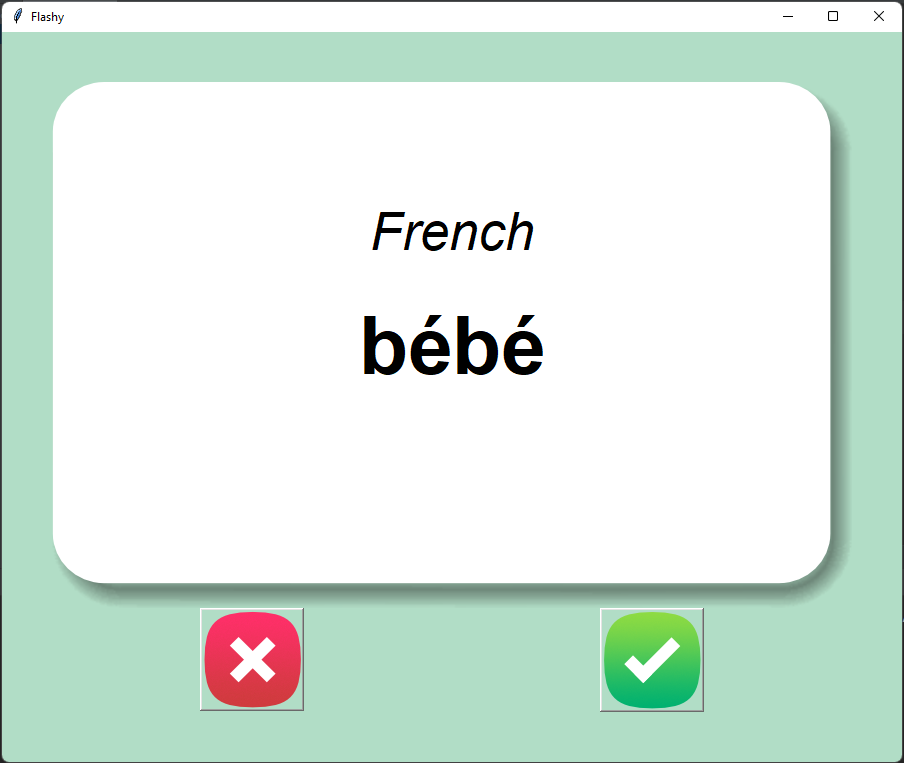

# Python-Flash-Card-App

It's an App for learning French top 100 frequently using words for basic undarstanding.
GUI to navigate to next words

## How to use
1. Download all files in one folder, which are present in this repositry
2. run the main.py file and app run

## Features
1. If you click on ✅, it's detect as you know this word and it is remove that word from your learning words. 
2. If you click on ❌, it's detect as you don't know word and it will remain in your learning words list.

EXAMPLE
  

Appréciez d'apprendre!!!

:)😊😁
